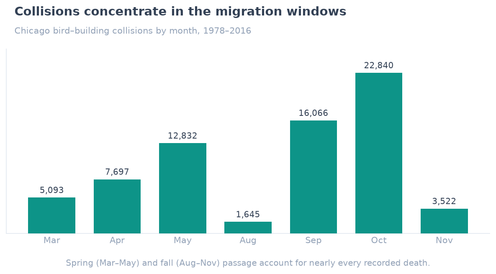
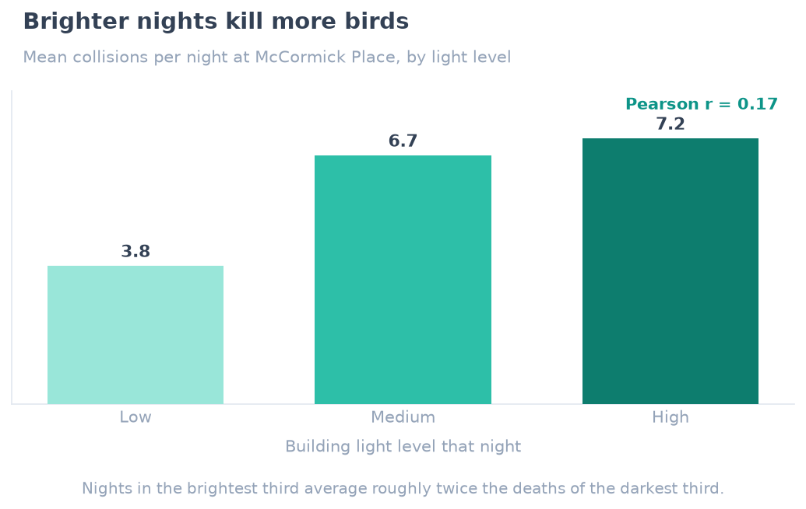
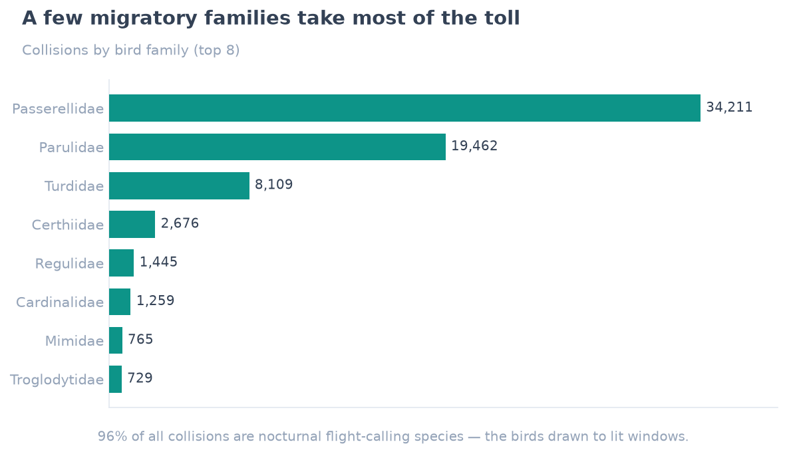
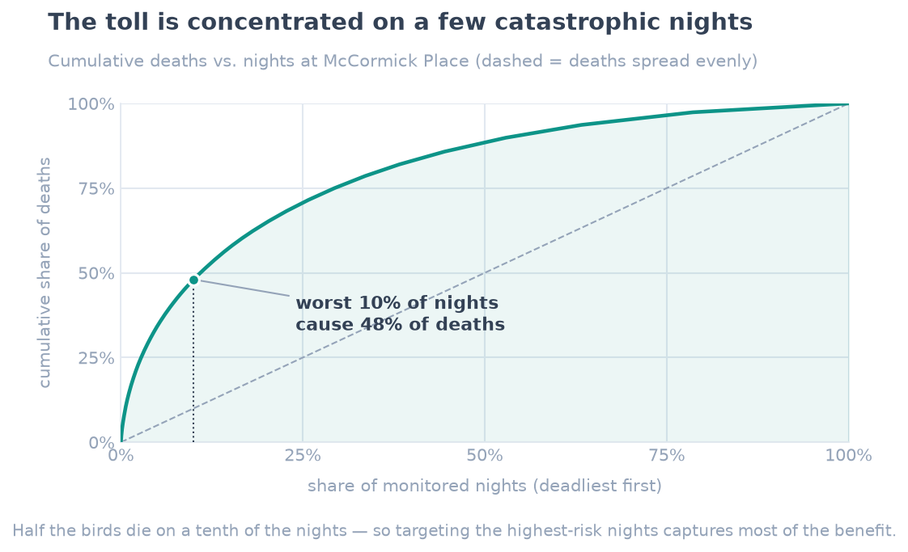

# Bird Data — what kills migrating birds in Chicago

Every spring and fall, night-migrating songbirds pass over Chicago. Some never
make it through: drawn off course by lit high-rise windows, they collide with
glass and die. This project takes **40 years of collision records** from the
Field Museum's monitoring of McCormick Place and the surrounding city, cleans and
merges them with nightly building-light data, and asks a simple conservation
question — **when, why, and to which birds does this happen?**

The answer is unusually actionable: the biggest driver is one a city can turn off.

## The findings

**1. Deaths track the migration calendar.** Collisions are almost entirely a
spring- and fall-passage phenomenon, peaking in October.



**2. Brighter nights kill more birds.** Joining each McCormick Place night to its
building-light score, nights in the brightest third average roughly **twice** the
collisions of the darkest third (Pearson r ≈ 0.17 across 1,641 nights). Light is
the environmental lever — and the one behind Chicago's "Lights Out" program.



**3. A single behaviour explains who dies.** **96%** of all collisions are
nocturnal *flight-calling* species — birds that vocalise in flight and are
disproportionately lured toward illuminated buildings. A handful of migratory
families (sparrows, warblers, thrushes) take most of the toll.



**4. And it lands on a handful of nights.** Collisions are extraordinarily
uneven: the **worst 10% of nights account for ~48% of all deaths** (the worst 1%
alone, ~14%). A typical night at McCormick Place kills 4 birds; the worst on
record killed 269. Those catastrophic nights are also the brightest (mean light
14.0 vs 11.5 on the rest) — heavy migration meeting lit glass.



**Takeaway for conservation:** mortality is concentrated in known migration
windows, rises with building light, and lands overwhelmingly on a few high-risk
nights — so a city doesn't need blanket lights-out. Targeting the **~10% of
nights with heavy passage and high light** would prevent close to half the
deaths at a fraction of the cost, which is exactly the kind of evidence behind
the lights-out programs in Chicago, New York, and Toronto.

## Pipeline

`etl.py` replaces what used to be a manual, error-prone spreadsheet routine —
download two files, retype columns, delete bad rows, VLOOKUP light scores onto
dates, add season columns — with one reproducible command:

```
collect  →  clean  →  merge  →  features  →  write
 fetch      type &     join       season/     processed
 sources    filter     on date    period      CSVs
```

`analyze.py` reads the processed data, computes the correlations, and writes the
three figures above. For a narrated, cell-by-cell version of the same analysis,
see **[`analysis.ipynb`](analysis.ipynb)**.

## Stack

- **Python** — pandas (ETL + analysis), matplotlib (figures)
- **Data** — [Winger et al. 2019](https://doi.org/10.1098/rspb.2019.0364),
  *Proc. R. Soc. B*, via the
  [TidyTuesday](https://github.com/rfordatascience/tidytuesday/tree/master/data/2019/2019-04-30)
  mirror — 69,695 collision records (1978–2016) and 3,067 nights of light data

## Run

```bash
python -m venv .venv && source .venv/bin/activate
pip install -r requirements.txt

python etl.py        # fetch + clean + merge -> data/processed/
python analyze.py    # correlations + figures/ + printed summary
```

Raw and processed data are regenerated by the pipeline and not committed; the
figures are, so this page renders on their own.

## Credit

Collision and light data © the study authors (Winger, Weeks, Farnsworth, Jones,
Hennen & Willard, 2019), used here for a non-commercial analysis. This repository
is my ETL, analysis, and write-up of their public dataset.
